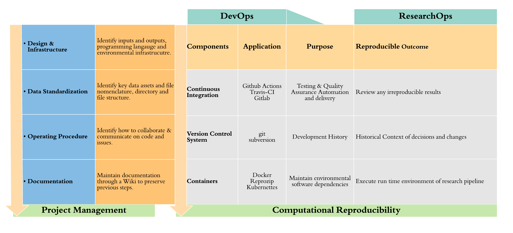

## Research Code 

> - Source code generated each year grows by about 20% <small>(L. Hatton & M. van Genuchten, 2019)</small>.

> - Data handling and processing are often informally transmitted.

> - Lack of formal training for researchers <small>(Koehler Leman et al., 2020)</small>.

> - Best practice for computational reproducibility?

> - How to navigate the available tools? 

The amount of source code generated for research continues to grow each year by about 20% (L. Hatton & M. van Genuchten, 2019) with such growth comes much responsibility however, as the demand for reproducible workflows and transparent research practices grows so does a need for industry best practice. 

Modern computational methods are an essential skill in today's scientific methodology. Computational research skills such as data handling and processing are often informally transmitted and are essential skills for early career researchers often found on advertising platforms (Maer-Matei et al., 2019). Yet, coding is often an ad-hoc process that is applied over the course of a projects life and a lack of formal training for researchers (Koehler Leman et al., 2020) and without much forethought to how to structure a scientific work flow for later reproduction. Data is often an active process of collection, cleaning, analysis and delivery yet the function of a published paper is rather static. What approach can we as scientist utilize to achieve transparency and computational reproducibility? How can we modernize our workflows to merge the static and dynamic processes of the scientific method? How do modern researchers navigate the plethora of tools available? 

## Computational Reproducibility 

- The ability to produce equivalent analytical outcomes from the same data set using the same code and software as the original study  (Fidler et al., 2017).

Computational reproducibility refers The ability to produce equivalent analytical outcomes from the same data set using the same code and software as the original study. 

## Have You Reproduced Lately?

> - Archmiller et al., (2020) Found 74 suitable for CR of the 19 obtained 13 were able to mostly or fully reproduce.
 
> - Obels et al., (2020) 62 articles identified, 41 had data available and 37 had analysis scripts. Could run scripts for 31 analysis and reproduced main results for 21 articles.

Archmiller et al., (2020) explored the level of computational reproducibility in the field of wildlife science. Found 74 suitable for CR of the 19 obtained 13 were able to mostly or fully reproduce. They concluded by recommend increase data sharing, organization and documentation and training. 

Obels et al., (2020) tried to reproduce results from registered psychology reports between 2014 to 2018. 62 articles identified, 41 had data available and 37 had analysis scripts. They could run scripts for 31 analysis and reproduced main results for 21 articles. They too recommend good research practices.

## {data-background="figures/bestpract.jpg"} 

What constitutes best practice? 

## Source of irreproducible results

> - Lack of a workflow framework

> - Missing software dependencies

> - Excluded data manipulation steps (Leipzig et al., 2020)

We need to identify what is best practice and what tools and components should we use in our scientific workflows? A common source of the inability to reproduce data and code is the lack of a workflow framework, missing software dependencies and excluded data manipulation steps (Leipzig et al., 2020). A problem addressed in the software engineering domain through Devops. DevOps (Development / Operations) is a cultural movement that aims the collaboration among stakeholders involved in the development, deployment and operation of software to deliver a high-quality product or service in the shortest possible time.

## DevOps

> - Version Control  TODO

> - Virtualization TODO

> - Continuous Practices (CI/CD) TODO

> - Testing #TODO

DevOps is now more commonly used to describe a suit of tools such as version control, infrastructure as code, virtualization, continuous delivery/deployment & testing. Unsurprisingly or perhaps surprisingly, scientists already are adopting these tools in their workflows. Version control is incorporated into Github, virtualization has now taken the form of containers like Docker and CI/CD can be used with Github Actions, Gitlab CI or Travis-CI. That is, take the already existing practices and tools from DevOps and integrate these into a best practice approach using commonly adopted tools already being implemented in scientific research and, treat the scientific workflow as software product.

## Research as Software Development 

> - No differences between researchers from computer science (Yasmin AlNoamany & John A. Borghi, 2018).

> - Computational reproducibility best approached by focusing on software as a product (Hocquet & Wieber, 2021).

> - Product is the reproducible outcome built around a scientific workflow. 

There is little difference between research and computer science and related disciplines in the use of software engineering. Furthermore, computational reproducibility is best approached by focusing on the research process as a software product. Product in the scientific sense is the reproducible outcome built around scientific workflow. ResearchOps is presented here as a case for scientific applications. 

## ResearchOps

The Case for DevOps in Scientific Applications  (de Bayser et al., 2015)

> - increase scientific productivity  (Peikert & Brandmaier, 2019); 

> - collaborate effectively within and between researchers (Díaz et al., 2019) and; 

> - aid in computational reproducibility  (Beaulieu-Jones & Greene, 2017) and transparency of their work  (Wittman & Aukema, 2020).

> - **Does this mean we have to learn computer science & multiple programming languages?**

The application of the DevOps, orchestrated into a seamless integrated process can increase productivity, collaborate and communicate effecticely within and between research members and team and aid in  computational reproducibility. Does this mean we have to learn computer science & multiple programming languages? No. As we will see identifying the scope of the research project at the onset can help build a framework for a scientific workflow and provide direction on what tools to implement. Most of the tools of which are freely available as open source and already used in the scientific community. 

## Worfkflows, pipelines and components

<section data-auto-animate>
  <ul>
    <li>Overall scope of the research project.</li>
    <li>Execution of each process or stages of the scientific workflow.</li>
    <li>Tools and/or software adopted to execute the pipeline to deliver research outcomes.</li>
  </ul>
</section>
<section data-auto-animate>
  <ul>
    <li>Scientific Workflow</li>
    <li>Overall scope of the research project.</li>
    <li>Pipeline</li>
    <li>Execution of each process or stages of the scientific workflow.</li>
    <li>Components</li>
    <li>Tools and/or software adopted to execute the pipeline to deliver research outcomes.</li>
  </ul>
</section>

To conceptualise this easier we look at researchops as three areas of focus: The project management level or scope, the pipeline and the components. 
Scientific workflows represent complex design pipelines that capture processing requirements for researchers throughout their investigations that allow the execution of data collection, data flow, computation, analysis in an integrative method to deliver and publish results (Catlin et al., 2019). This is the project management level. 
The pipeline is a set of discrete stages in which a series of automated transformations and tests are performed on the raw data. Each stage is identified through the overall scope of the scientific workflow so that each stage has a purpose. 
The components are the tools used in software development to address inconsistencies in code through automated testing and quality assurance measures so that the product maintains a standard before deployment or delivery. This ensures that the pipeline adheres to data management protocols. For researchers, this means adding testing to their tool kits and automating such tasks through continuous integration that can provide rapid feedback when a component fails and maintain a reliable pipeline. Testing is something that has not been fully adopted in modern scientific methods. This could explain as to why some previous computational reproduction attempts have not been as successful. 

## Examples 

- (White et al., 2019) Ecological forecast system  - Using **R** to work with data and fit models, make forecasts and archive for delivery to stakeholders. Created a **automated pipeline** using **CI** to run once a week. 

- (Yenni et al., 2019) Biology example using existing open source tools by performing **QA**, import, restructure data, **versioning** and archiving, rapid publishing(delivery), **automate** steps to reduce time. 

Examples from ecology and biology demonstrate that adopting ResearchOps approach enables up to date data and forecasting, reduces analysis time and deliver results to stakeholders. Additionally, using freely available open source tools. 

## ResearchOps Framework 

</img>

Presented here is the overall ResearchOps framework. Any coding and git related UI can be substituted as long as the tools address the purpose and reproducible outcome. The project level is essentially an area where we focus on the "plan" or scope of the research outcome.
By scoping out the processes needed, indentyfing stakeholders and how to collaborate and communicate results then directs us to design the discrete stages of the pipeline in our chosen scripting language. This then wrapped into a container and the pipeline is designed and calibrated in such a way as to meet the initial scope of the project. 

Each of the components in the pipeline address a reproducibile outcome to ensure long term preservation of the methods and results. 
Note though, it would be ideal to have this at the onset of a project however, taking a step back and going through this process can also be beneficial. This can also be adopted by a single researcher and scaled to larger collaborative research projects. 

Containers: libs and dependencies or the computational environment at runtime/

## Thank You! 

</img> **@aaron_willcox**

## Test Slide 

<section data-markdown>
    ## Page title
    A paragraph with some text and a [link (http://hakim.se).
</section>
